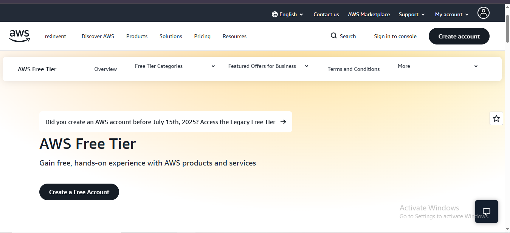
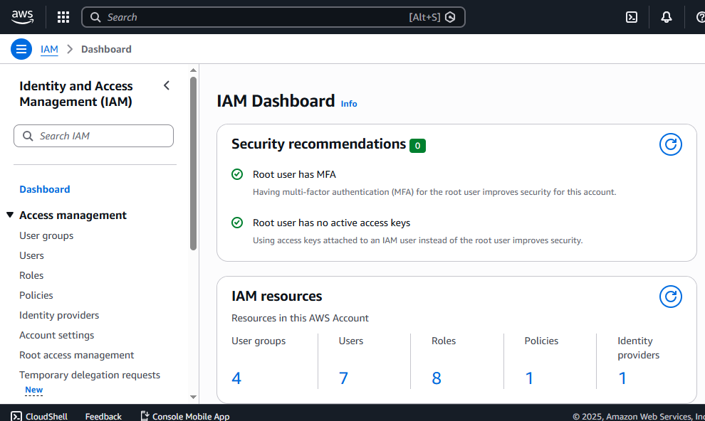
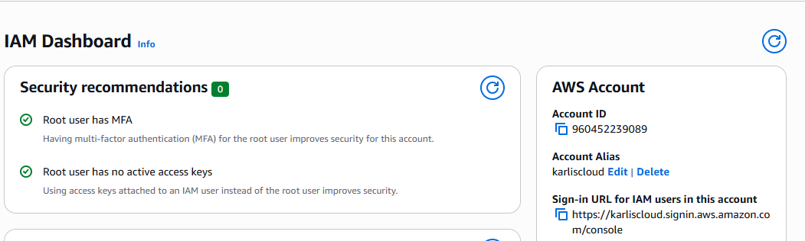
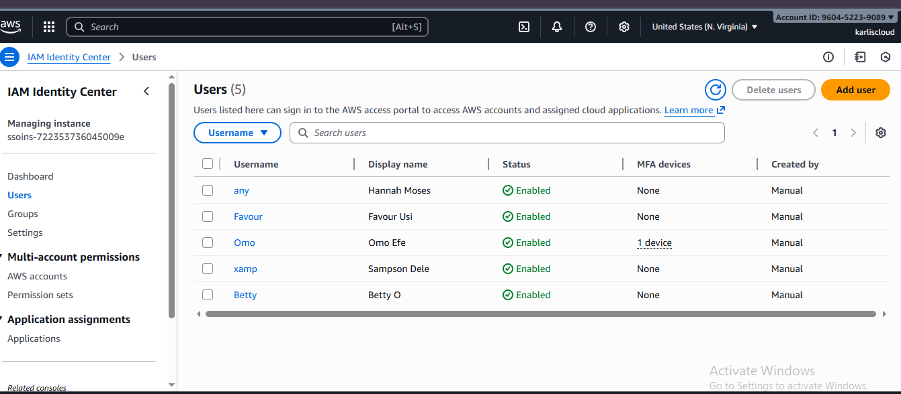

# AWS Account Setup

This guide covers:

- [AWS Account Creation](#aws-account-creation)
- [AWS Organizations](#aws-organizations)
- [IAM Users and Access](#iam-users-and-access)

---

## AWS Account Creation

# Creating an AWS Free Tier Account

After learning AWS Cloud fundamentals, service categories, and global infrastructure,
benefits, and pricing, the next step is to create an AWS Free Tier account and start building hands-on.

---

## Step-by-Step Guide to Create an AWS Account

1. Go to the AWS Free Tier page (https://aws.amazon.com/free/)
2. Click **Create a Free Account**
   

4. Enter your email address and account name
   - Use your name or company name
5. Verify your email using the code sent to your inbox
6. Set a strong, secure password
7. Provide contact information:
   - Choose **Personal** for learning/testing
   - Choose **Professional** for business use
8. Add a payment method (used for identity verification only)
9. Verify your identity via phone
10. Choose a Support Plan:
   - **Basic** (free and recommended for beginners)
11. Click **Complete Sign-Up**

You can now log in to the **AWS Management Console**.

---

## Secure Your Root Account with MFA (Highly Recommended)

The **root user** is the account owner and has unrestricted access.
It will need to be secured immediately.

Steps:
1. Go to the **IAM Dashboard**
2. Select **Add MFA**
3. Use an authenticator app such as:
   - Google Authenticator
   - Authy

This adds an extra layer of protection against unauthorized access.

---

## Creating an AWS Account Alias

An **Account Alias** replaces the default 12-digit AWS account ID with a
custom, human-friendly sign-in URL.

### Example
Instead of:
https://<account-id>.signin.aws.amazon.com/console

Use:
https://<account-alias>.signin.aws.amazon.com/console

### Benefits
- Easier to remember
- More professional appearance
- Simplifies login for IAM users and administrators

### Steps to Create an Alias
1. Open **IAM Dashboard**
2. Go to **Account Settings**
3. Click **Create Account Alias**
4. Enter your preferred name (e.g., `blessing-cloud`)
5. Save changes

---

## Final Tip

Your AWS Free Tier account opens the door to a real cloud experience —
from compute and storage to AI, analytics, and automation.

Take time to explore, learn, and **secure your environment properly**.

## AWS Organizations

# AWS Organization Setup

Note: Screenshots have been sanitized to remove sensitive account information.

This guide will walk you through creating AWS Organization accounts, IAM Identity Center Users, groups, and permission sets.

# AWS Organization Account Creation Documentation

## Introduction

Cloud environments often require multiple accounts to separate workloads, manage permissions, and maintain security boundaries.

The **AWS Organization Account Creation Documentation** provides a structured approach to building such an environment using **AWS Organizations** and **Identity and Access Management (IAM)**.

This project focuses on:

- Creating a centralized **management account**
- Adding and organizing **member accounts**
- Setting up **IAM users, groups, and policies**
- Testing access controls for proper permission management

The goal is to demonstrate a secure, organized, and scalable AWS setup that aligns with best practices in cloud governance and administration.

## **Project Objectives**

1. Create and configure an AWS Organization with 3 member accounts
2. Set AWS IAM with 5 users
3. Group users by roles (eg, Admin, DevOps, Security)
4. Create and attach IAM Policies to manage permissions

## Tools Required

1. AWS Management Console
2. Internet Access
3. Basic AWS Account

### Step-by-Step Process

Step 1 —  Create or Access a management account

- Sign in to the AWS Management console using the root user account because only an admin can perform this function.
- The root user account will become the management account, and as such, AWS recommends that it should not have resources or workloads. This means your Dev., Staging, and Production accounts should be separate from the management account.

Step 2 — Create an AWS Organization account

- Search for AWS Organization
- Click Create an organization
- Wait for the Organization to get created

Step 3 — Add member accounts

- Click Add AWS account to create other accounts (for Dev, Staging, and Production)
- Click Create an AWS account
- Enter the account name. Eg Development Account
- Enter an email address that has not been used to create an AWS account
- Click Create AWS account

The newly created account (Development Account) does not come with login details. 

To access it;

- Log in to the AWS console as a root user
- Enter the email address for the Development Account
- Since the account was created without a password, click forgot password
- An email with instructions to reset your password will be sent
- Set and confirm the password, and sign in again
- Repeated the same process for the other organization accounts (Staging and Production)

Setting up IAM Identity Center Groups

Create 3 groups based on roles

1. **Admin-Team**
- Log in as the **root user**.
- In the search bar, type IAM Identity Center and select it.
- In the left sidebar, click User groups. → Click the Create group
- Enter a Group Name Admin Team → Description
- Click Create User Group

1. **DevOps-Team**
- Same as the steps done in creating the Admin Team, but the name of the group was changed to DevOps Team

1. **System-Admin-Team**
- Same as the steps done in creating the Admin Team, but the name of the group was changed to System-Admin Team

Adding  Permissions 

- Log in to the console as the **root user**
- In the search bar, type IAM Identity Center and select it.
- Click Permission set
- Click Create Permission Set
- Select predefined permission set
- Select an AWS managed policy depending on the role of the identity users: AdministratorAccess → Next
- Give a description
- Give session duration → Next
- Click create

Repeat the above process for PowerUserAccess and SystemAdministrator

Setting up IAM Identity Center Users

- Log in as the **root user**.
- In the search bar, type IAM Identity Center and select it.
- Click on users → Add user
- Enter the details → Next
- Select group(s) you want for the user → Next
- Click Add user
- The user will receive an email with a link to set up a password
- The user will then be prompted to register an MFA device before gaining access to the console

Repeat the steps above for the other 4 users

### Verify and Test Permissions

Omo Efe in the DevOps Group has the PowerUserAccess in the Development Account

### Documentation and submission

1. A diagram of the AWS Organization was created
2. List of users, groups, and permissions
3. Notes from permission testing
4. Screenshots of IAM setup and login verification

## IAM Users and Access

(content from iam-users-and-access.md)
