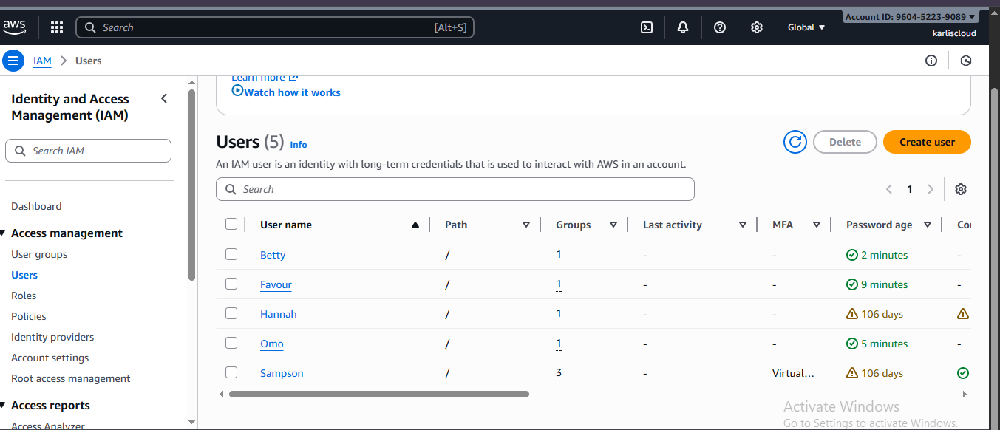
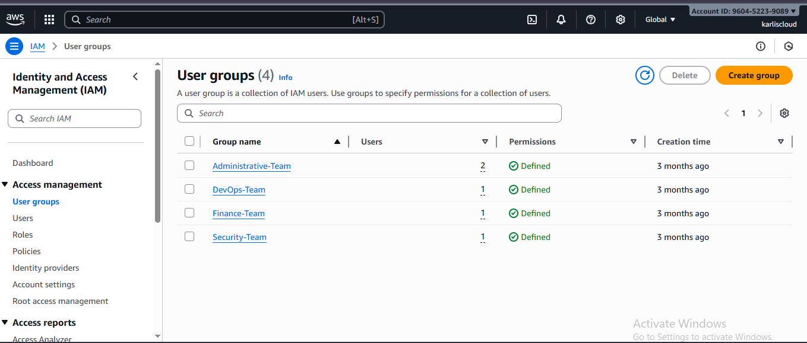

# AWS IAM Users and groups set up

Note: Screenshots have been sanitized to remove sensitive account information.

This guide will walk you through creating AWS IAM users and groups

# IAM Users, Groups, Roles & Policies

In AWS, security starts with identity, and that is where **AWS Identity and Access Management (IAM)** comes in.

IAM helps organizations control **who can access AWS resources** and **what actions they can perform**, ensuring that users, applications, and systems operate securely within defined boundaries.

---

## What is IAM?

AWS Identity and Access Management (IAM) is a web service that manages:

- **Authentication** – who can sign in
- **Authorization** – what actions they are allowed to perform

When an AWS account is created, it starts with a **root user**, which has unrestricted access.  
AWS strongly recommends creating **IAM users** for day-to-day operations instead of using the root account.

---

## Why Use IAM?

IAM enables you to:

- Securely manage workforce and application access
- Apply fine-grained permissions using policies
- Enforce the **principle of least privilege**
- Enable temporary credentials and cross-account access
- Analyze and right-size permissions as your environment scales

---

## Creating an IAM User

1. Sign in to AWS as the **root user**
2. Navigate to **IAM → Users**
3. Click **Create user**
4. Enter a username (for example: `carlos`)
5. Enable **AWS Management Console access** and generate a password
6. Download the credentials (CSV file)
7. Sign in as the new IAM user and change the password
8. Enable **Multi-Factor Authentication (MFA)** for additional security

---

## IAM Best Practices

- Avoid using the root account for daily operations
- Enable MFA for all IAM users
- Manage permissions using **IAM groups**, not individual users
- Apply **least privilege** access at all times
- Regularly rotate access keys
- Monitor activity using **AWS CloudTrail** and **IAM Access Analyzer**

---

## What is an IAM Group?

An **IAM Group** is a collection of IAM users managed as a single unit.  
Instead of assigning permissions individually, you can group users (e.g., Developers, Admins, Support) and assign policies to the group at once.  

This approach saves time and ensures **consistent access control** across your AWS environment.

---

## Benefits of Using IAM Groups

- Easier permission management
- Consistent access control
- Scales well for large teams
- Supports the **principle of least privilege**

---

## How to Create an IAM Group

1. Log in to the AWS Management Console and navigate to **IAM**
2. Click **User groups → Create group**
3. Enter a group name (e.g., Developers, Admins)
4. Optionally attach policies and add users to the group
5. Click **Save**

Once users are added, they **automatically inherit the group's permissions**.  
A single user can belong to multiple groups, which is ideal for cross-functional roles.

---

## 5. IAM Policies

### Managed Policies
- AWS-managed (e.g., AmazonS3ReadOnlyAccess)
- Customer-managed

### Inline Policies
- Embedded directly into a user or role
- Use sparingly

---

## 6. Security Best Practices

- Enable MFA for IAM users
- Follow the least privilege principle
- Rotate access keys
- Avoid using the root account

---

## 7. Summary
IAM is the backbone of AWS security.
Always control access using users, groups, roles, and policies.
