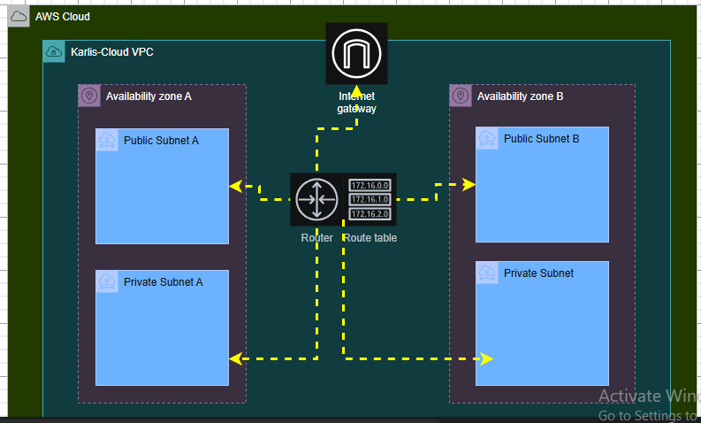

AWS VPC Creation Guide

This repository documents the step-by-step creation of an AWS Virtual Private Cloud (VPC) using best practices.
It is written for beginner to intermediate cloud learners and serves as a practical reference for real-world AWS networking.

1. What is a VPC?

An Amazon Virtual Private Cloud (VPC) is a logically isolated virtual network in AWS where you can launch resources such as:

EC2 instances

RDS databases

Load Balancers

A VPC gives you full control over:

IP addressing (CIDR blocks)

Subnets

Route tables

Internet connectivity

Network security

2. VPC Architecture Overview

A typical VPC architecture includes:

VPC (CIDR block)

Public subnets

Private subnets

Internet Gateway (IGW)

NAT Gateway

Route tables

Security Groups

Network ACLs (NACLs)

This setup separates internet-facing resources from backend resources, improving security and scalability.

3. Planning Before VPC Creation
3.1 Choose a Region

Select an AWS region closest to your users to reduce latency.

3.2 Design the CIDR Block

Use private IP ranges (RFC 1918):

10.0.0.0/16 (used in this guide)

3.3 Decide Subnet Structure

Public Subnets → ALB, Bastion Host

Private Subnets → Application servers, Databases

4. Create the VPC

Steps:

Open AWS Console → VPC Dashboard

Click Create VPC

Choose VPC only

Configure:

Name: karlis-enterprise-vpc

IPv4 CIDR block: 10.0.0.0/16

Tenancy: Default

Click Create VPC

📷 Screenshot:

5. Create Subnets
5.1 Public Subnets
Subnet Name	CIDR	Availability Zone
public-subnet-1	10.0.1.0/24	us-east-1a
public-subnet-2	10.0.2.0/24	us-east-1b

Steps:

Go to Subnets → Create subnet

Select your VPC

Create each subnet in a different AZ

📷 Screenshot:

5.2 Private Subnets
Subnet Name	CIDR	Availability Zone
private-subnet-1	10.0.3.0/24	us-east-1a
private-subnet-2	10.0.4.0/24	us-east-1b

📷 Screenshot:

6. Create and Attach Internet Gateway (IGW)

An Internet Gateway (IGW) allows public subnets to communicate with the Internet.

Steps:

Go to Internet Gateways → Create

Name: karlis-enterprise-igw

Attach the igw to karlis-enterprise-vpc

📷 Screenshot:

7. Create NAT Gateway

A NAT Gateway allows instances in private subnets to access the internet without being publicly exposed.

Steps:

Go to NAT Gateways → Create

Name: karlis-enterprise-nat-gw

Select:

VPC

Public subnet

Allocate an Elastic IP

Create NAT Gateway

📷 Screenshot:

8. Configure Route Tables
Default Route Table

Initially contains: 10.0.0.0/16 → local

8.1 Public Route Table

Create:

Name: public-rt

VPC: karlis-enterprise-vpc

Routes: 0.0.0.0/0 → Internet Gateway

Associate with:

Public subnets only

📷 Screenshot:

8.2 Private Route Table

Create:

Name: private-rt

Routes: 0.0.0.0/0 → NAT Gateway

Associate with:

Private subnets only

📷 Screenshot:

9. Network ACLs (NACLs)

Network ACLs are stateless and operate at the subnet level.

Steps:

Create NACL: nacl-karlis-enterprise

Add inbound and outbound rules as required

Associate with subnets

📷 Screenshot:

10. Security Groups (SG)

Security Groups are stateful firewalls attached to AWS resources.

Steps:

Create SG: karlis-enterprise-sg

Inbound:

Allow required ports

Use My IP for testing only

Outbound:

Allow all traffic

📷 Screenshot:

11. Validation Checklist

✔ VPC created
✔ Subnets assigned correctly
✔ IGW attached
✔ Route tables configured
✔ NAT Gateway working
✔ Security rules applied

12. Best Practices

Use multiple AZs for high availability

Keep databases in private subnets

Apply least-privilege security rules

Tag all AWS resources

Avoid 0.0.0.0/0 for sensitive ports

13. Summary

This guide demonstrates an enterprise-ready AWS VPC setup with proper routing, security, and subnet isolation.

It is suitable for:

Learning AWS networking

Portfolio projects

Real-world cloud environments

Author:
Blessing Usifoh-Oamen
