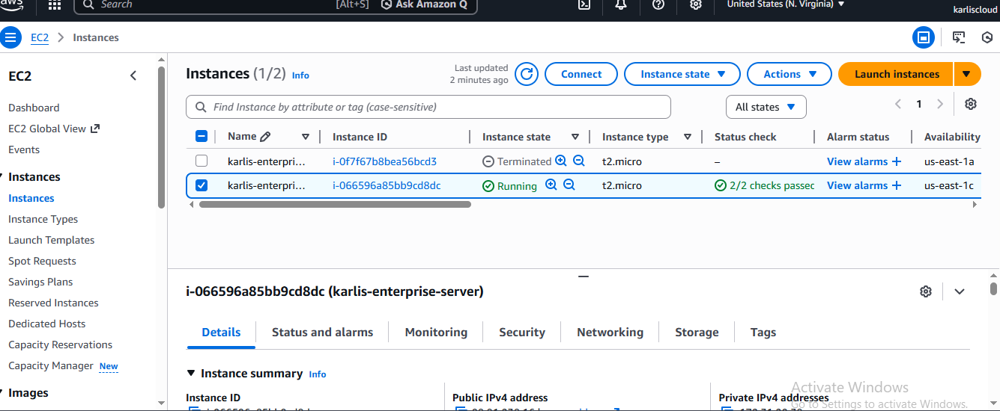
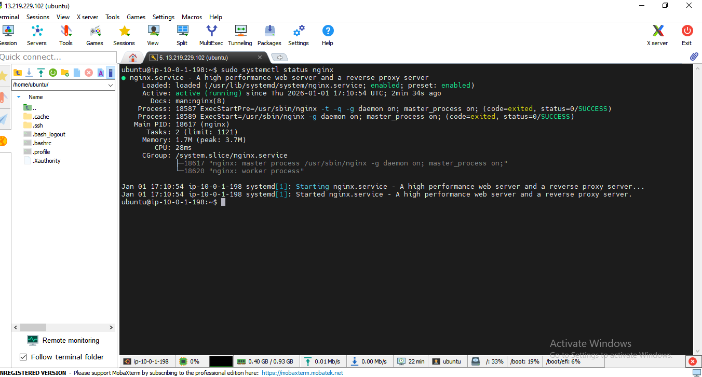

# Web Application Deployment on AWS EC2 Using an Existing VPC

# Introduction

This project demonstrates how to deploy a web application on Amazon Web Services (AWS) using an **existing Virtual Private Cloud (VPC)** created in a previous project.

The implementation involves launching an EC2 instance within a preconfigured network, securely accessing the server via SSH, installing and configuring the **Nginx web server** on an Ubuntu instance, and deploying website content from a GitHub repository.

Additionally, a **custom domain name** is configured to point to the hosted application, making the website publicly accessible over the Internet. This project showcases the practical deployment of cloud infrastructure, networking, security configuration, and real-world web hosting on AWS.

# Project Objectives

1. Use the VPC created in the previous project to deploy resources  
2. Launch and configure an EC2 instance in a public subnet  
3. Install and manage web server services using Nginx  
4. Deploy a web application from a GitHub repository  
5. Integrate a custom domain name using DNS  
6. Validate web access via public IP and domain name  

# Steps

# 1. Launch an EC2 Instance

- Navigate to **EC2 → Instances → Launch instance**
- Instance name: `karlis-enterprise-server.`
- AMI: Ubuntu
- Instance type: `t2.micro` (suitable for this project)
- Select an existing key pair or create a new one
- Edit network settings:
  - Choose the existing VPC
  - Select the **public subnet**
  - Enable **Auto-assign public IP**
- Attach the appropriate **security group**
- Launch the instance

### 2. Access the Server

- Connect to the EC2 instance using **MobaXterm (SSH)**
- Update and upgrade server packages

sudo apt update && sudo apt upgrade -y

3. Install and Verify Nginx

Install the Nginx web server

Check the service status to ensure it is running

sudo apt install nginx -y
sudo systemctl start nginx
sudo systemctl enable nginx
sudo systemctl status nginx

4. Verify Nginx in the Browser

Open a web browser

Visit:

http://<EC2-PUBLIC-IP>

nginx-default-page.png

The default Nginx welcome page confirms successful installation

5. Clone the Web Application Repository

Clone the project repository:

git clone https://github.com/digitalwitchdemo/mediplus.git

Navigate into the directory and list the contents:

cd mediplus
ls

6. Deploy Website Files to Nginx Directory

Confirm the current directory path:

pwd

Navigate to the Nginx web root:

cd /var/www/html

Return to the home directory and enter the mediplus folder

Move all website files to the Nginx directory:

sudo mv ./* /var/www/html

Verify the files were moved successfully:

ls /var/www/html

7. Verify the Deployed Website

Refresh the browser using the EC2 public IP address

The deployed website should now be visible

8. Configure DNS with Namecheap

Log in to Namecheap

Update DNS records to point the domain to the EC2 public IP address

9. Verify DNS Propagation

Check DNS propagation to confirm global availability

10. Access the Website Using the Domain Name

Paste the custom domain name into a web browser

Confirm the website loads successfully

